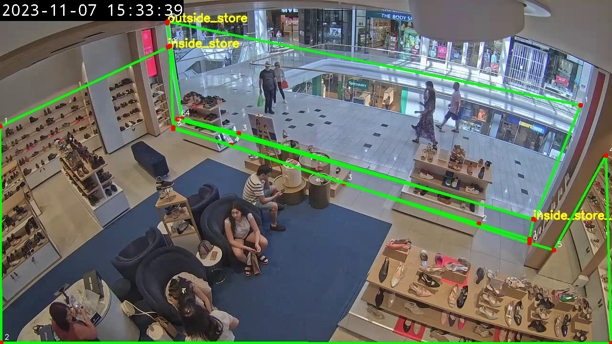

# Retail Video Analytics

## 1. Data Inspection and ROI Setup

The first stage of the project is to inspect the input video and define the regions of interest (ROIs) required for the entrance analysis.

The entrance video was inspected first to understand its resolution, frame rate, frame count, and duration. Based on the video frame, three ROIs were then defined and visually verified.

---

### 1.1 Video Inspection

The video was first inspected using:

```text
scripts/inspect_video.py
```

The responsibility of this script is to extract the basic properties of the input video:

- Resolution
- FPS
- Number of frames
- Duration

The entrance video was found to have the following properties:

| Property | Value |
|---|---:|
| Resolution | 1280 × 720 |
| FPS | 30.0 |
| Frames | 13,421 |
| Duration | 447.37 seconds |

The video therefore uses a `1280 × 720` coordinate system. These coordinates are used when defining the ROIs.

#### Running the script

The script is executed inside the project Docker container:

```bash
docker run --rm \
-v "$(pwd):/workspace/retail-video-analytics" \
-w /workspace/retail-video-analytics \
retail-video-analytics:latest \
python scripts/inspect_video.py
```

The project directory is mounted into the container so that the script can access the videos and write its output to the repository.

---

### 1.2 ROI Reference Frame

After inspecting the video, a reference frame was generated to identify the relevant areas of the store entrance.

The utility used for this is:

```text
scripts/make_roi_reference.py
```

This script extracts a frame from the entrance video and saves it as an image that can be inspected while defining the ROI coordinates.

#### Running the script

```bash
docker run --rm \
-v "$(pwd):/workspace/retail-video-analytics" \
-w /workspace/retail-video-analytics \
retail-video-analytics:latest \
python scripts/make_roi_reference.py
```

The generated reference image is used only for scene/ROI inspection.

---

### 1.3 ROI Definition

Three separate regions were identified in the entrance scene:

1. `outside_store`
2. `inside_store_entering_area`
3. `inside_store`

The three regions are kept separate because the entrance itself is a transition area.

A person can also span multiple regions in a single frame. For example, the person's upper body may still be in the outside region while their legs/feet are already in the entrance region.

Therefore, the entrance area is explicitly represented instead of treating the scene as only:

```text
outside → inside
```

The spatial model is:

```text
outside_store
      ↓
inside_store_entering_area
      ↓
inside_store
```
To define the ROI polygons, a browser-based annotation utility was created:

```text
scripts/roi_annotator.html

---

### 1.4 ROI Configuration

The ROI coordinates are stored in:

```text
configs/entrance.yaml
```

Keeping the coordinates in YAML allows the scene geometry to be changed without modifying the Python implementation.

The current configuration is:

```yaml
rois:
  outside_store:
    polygon:
      - [350, 45]
      - [1214, 220]
      - [1117, 460]
      - [499, 279]
      - [380, 248]
      - [349, 48]

  inside_store_entering_area:
    polygon:
      - [1115, 458]
      - [1107, 500]
      - [1001, 468]
      - [719, 383]
      - [483, 303]
      - [362, 269]
      - [371, 249]

  inside_store:
    polygon:
      - [351, 98]
      - [0, 264]
      - [2, 717]
      - [1278, 718]
      - [1267, 325]
      - [1158, 523]
      - [1107, 508]
      - [362, 266]
      - [355, 96]
```

The coordinates correspond to the original `1280 × 720` video frame.

---

### 1.5 ROI Visualization

Once the ROI coordinates were defined, they were visualized on the video frame to verify that they correctly matched the physical regions in the scene.

The visualization utility is:

```text
scripts/visualize_rois.py
```

The script:

1. Loads the ROI configuration from `configs/entrance.yaml`.
2. Opens the entrance video.
3. Reads the polygon coordinates.
4. Draws the three ROI polygons on the selected frame.
5. Produces an image for visual verification.

#### Running the visualization

```bash
docker run --rm \
-v "$(pwd):/workspace/retail-video-analytics" \
-w /workspace/retail-video-analytics \
retail-video-analytics:latest \
python scripts/visualize_rois.py
```

The generated visualization was manually inspected and the ROI boundaries were verified against the actual scene.

---

### 1.6 ROI Classification

The reusable ROI-related logic is maintained in:

```text
src/roi_utils.py
```

The purpose of this module is to provide the geometric functionality that will later be used by the detection and tracking pipeline.

For a detected person, the intended reference point is the **bottom-center of the bounding box**.

For a bounding box:

```text
(x1, y1, x2, y2)
```

the bottom-center point is:

```text
x = (x1 + x2) / 2
y = y2
```

Conceptually:

```text
        Person Bounding Box
       ┌──────────────────┐
       │                  │
       │      Person      │
       │                  │
       │                  │
       └────────●─────────┘
             bottom-center
```

This point is more useful for determining the person's physical location than requiring the entire bounding box to fall inside one ROI.

This is particularly important around the entrance boundary, where a person's body can overlap multiple regions.

The ROI geometry itself is therefore separated from the later detection and tracking logic.

---



### 1.7 Files Used in This Stage

The files involved in the current stage are:

```text
configs/
└── entrance.yaml

scripts/
├── inspect_video.py
├── make_roi_reference.py
└── visualize_rois.py

src/
└── roi_utils.py
```

#### Responsibilities

| File | Responsibility |
|---|---|
| `configs/entrance.yaml` | Stores entrance video and ROI configuration |
| `scripts/inspect_video.py` | Inspects video properties |
| `scripts/make_roi_reference.py` | Generates a reference frame for scene inspection |
| `scripts/visualize_rois.py` | Visualizes and verifies ROI polygons |
| `src/roi_utils.py` | Contains reusable ROI/geometric logic |

---

### 1.8 Current Status

At the end of this stage:

- The entrance video properties have been verified.
- A reference frame has been generated.
- Three entrance ROIs have been defined.
- ROI coordinates have been stored in YAML.
- The ROI polygons have been visually verified.
- The bottom-center point has been selected as the reference point for future person-to-ROI classification.

The next stage is to introduce **person detection and tracking** and connect the detected person's position to the verified ROI configuration.

## 2. Person Detection and Tracking

After defining and verifying the three ROIs, person detection and tracking were evaluated to obtain stable person identities before implementing the ROI-based entry/exit logic.

### Person Detection

- Initial model: **YOLO11n**
- Class: **person**
- Initial issue: some people were missed in individual frames, resulting in false negatives.
- No significant false-positive detections were observed.
- The detector was upgraded to **YOLO26m**, which provided more stable person detections on the target video.

### Multi-Object Tracking

- Initial tracker: **ByteTrack**
- Challenge: longer detection gaps caused tracks to terminate and the same person could receive a new ID.
- **BoT-SORT** was evaluated as an alternative.
- Track buffer was increased to tolerate temporary detection gaps.
- Camera motion compensation was disabled because the camera is stationary.

### Selected Configuration

The current configuration is:

- **Detection:** YOLO26m
- **Tracking:** BoT-SORT
- **Detection class:** person
- **Camera:** stationary
- **Track buffer:** increased to handle temporary detection gaps

The resulting detection and tracking behaviour is **mostly stable** and is sufficient to proceed with the next stage.

### Experiments

| Configuration | Result |
|---|---|
| YOLO11n | Some false negatives |
| YOLO11n + ByteTrack | ID changes after longer detection gaps |
| YOLO11n + BoT-SORT | Improved tracking but detector remained limiting |
| YOLO26m + BoT-SORT | Mostly stable detection and tracking |

### Files

- `scripts/detect_persons.py` — Person detection experiment and visualization.
- `scripts/track_persons.py` — Person detection and multi-object tracking.
- `configs/botsort.yaml` — BoT-SORT tracker configuration.

### Docker Commands

Person detection:

```bash
docker run --rm \
--gpus all \
-v "$(pwd):/workspace/retail-video-analytics" \
-w /workspace/retail-video-analytics \
retail-video-analytics:latest \
python scripts/detect_persons.py
```

Person track:
``` bash 
docker run --rm --gpus all -v "$(pwd):/workspace/retail-video-analytics" -w /workspace/retail-video-analytics retail-video-analytics:latest python scripts/track_persons.py
```

## 2. Person Detection and Tracking

After defining and verifying the three ROIs, person detection and tracking were evaluated to obtain stable person identities before implementing the ROI-based entry/exit logic.

### Person Detection

- Initial model: **YOLO11n**
- Class: **person**
- Initial issue: some people were missed in individual frames, resulting in false negatives.
- No significant false-positive detections were observed.
- The detector was upgraded to **YOLO26m**, which provided more stable person detections on the target video.

### Multi-Object Tracking

- Initial tracker: **ByteTrack**
- Challenge: longer detection gaps caused tracks to terminate and the same person could receive a new ID.
- **BoT-SORT** was evaluated as an alternative.
- Track buffer was increased to tolerate temporary detection gaps.
- Camera motion compensation was disabled because the camera is stationary.

### Selected Configuration

The current configuration is:

- **Detection:** YOLO26m
- **Tracking:** BoT-SORT
- **Detection class:** person
- **Camera:** stationary
- **Track buffer:** increased to handle temporary detection gaps

The resulting detection and tracking behaviour is **mostly stable** and is sufficient to proceed with the next stage.

### Experiments

| Configuration | Result |
|---|---|
| YOLO11n | Some false negatives |
| YOLO11n + ByteTrack | ID changes after longer detection gaps |
| YOLO11n + BoT-SORT | Improved tracking but detector remained limiting |
| YOLO26m + BoT-SORT | Mostly stable detection and tracking |

### Files

- `scripts/detect_persons.py` — Person detection experiment and visualization.
- `scripts/track_persons.py` — Person detection and multi-object tracking.
- `configs/botsort.yaml` — BoT-SORT tracker configuration.

### Docker Commands

Person detection:

```bash
docker run --rm \
--gpus all \
-v "$(pwd):/workspace/retail-video-analytics" \
-w /workspace/retail-video-analytics \
retail-video-analytics:latest \
python scripts/detect_persons.py
```